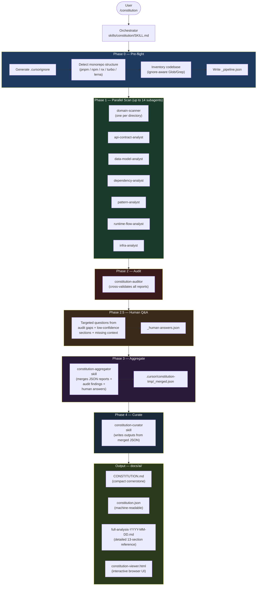

# Cursor Constitution Generator

A Cursor plugin that analyses a brownfield codebase and produces
`docs/ai/CONSTITUTION.md` — a compact cornerstone for downstream AI workflows —
backed by a detailed `docs/ai/full-analysis-YYYY-MM-DD.md` reference document.

The constitution grounds later stages (spec, design, tasks, dev, QA) by giving
them a brownfield baseline derived from the existing codebase. It does not replace
spec or design — it defines **WITHIN WHAT** those stages operate.

---

## Installation

### Option A — Direct URL install (recommended)

Run this command in Cursor agent chat:

```
/add-plugin https://github.com/zlatkomq/legacy_ai_analyser
```

### Option B — Cursor Marketplace

1. Open the Marketplace panel in Cursor
2. Search **constitution-generator**
3. Install (project-scoped or user-level)

### Option C — Manual (non-plugin)

Use the `non-plugin` branch and `install.sh`:

```bash
git clone https://github.com/zlatkomq/legacy_ai_analyser.git
cd legacy_ai_analyser
git checkout non-plugin
cd /path/to/your/project
bash /path/to/legacy_ai_analyser/install.sh
```

---

## Quick start

**Prerequisites:** Cursor 2.4+ and an existing codebase to analyse.

1. Install the plugin (see above)
2. Open your **target project** in Cursor (the brownfield codebase, not the plugin repo)
3. In agent chat, run:

```
/constitution
```

The pipeline will:
1. Generate `.cursorignore` (excludes noise from analysis)
2. Scan the codebase with parallel specialist agents
3. Audit findings for consistency and confidence
4. Ask you targeted questions to fill gaps (skippable)
5. Produce the final outputs

### What it produces

Once complete, four files are written into your project:

| File | Purpose |
|------|---------|
| `docs/ai/CONSTITUTION.md` | Compact cornerstone (~600-800 words) — DO/DO NOT rules, patterns, naming, tech stack |
| `docs/ai/constitution.json` | Machine-readable version for structured lookups |
| `docs/ai/full-analysis-YYYY-MM-DD.md` | Detailed 13-section reference with confidence and evidence |
| `docs/ai/constitution-viewer.html` | Interactive browser UI of the full analysis |

### How to use it

**Primary use:** Paste `CONSTITUTION.md` as **preamble / guardrails** in the prompt
for your downstream agents (spec, design, tasks, dev, QA) so the AI respects the
project's constraints, patterns, and DO/DO NOT rules.

```
You are a [spec/design/implementation/QA] agent.

Read the project constitution below. It defines the constraints, patterns,
and rules of the existing system. Your work must respect these.

<constitution>
{paste contents of docs/ai/CONSTITUTION.md here}
</constitution>

Now: [your actual task prompt]
```

Optional: for deep dives use `full-analysis-*.md`; for structured lookups use
`constitution.json`. See [docs/DOWNSTREAM-GUIDE.md](docs/DOWNSTREAM-GUIDE.md) for
full integration patterns when you need them.

### Review tips

- Open `docs/ai/constitution-viewer.html` in a browser for an interactive view
  (searchable sidebar, confidence badges, DO/DO NOT split layout, debt register)
- Check sections marked `[NEEDS REVIEW]` — human validation needed before relying
  on those downstream
- Share the viewer with your team as a single HTML file

### Keeping it up to date

| Situation | Command |
|-----------|---------|
| Code changed significantly | `/constitution` — full re-run |
| You found an error | `/constitution-patch` — corrects a specific claim, survives re-runs |

---

## What's in the plugin

```
constitution-generator/
├── .cursor-plugin/
│   └── plugin.json                         ← Plugin manifest
├── agents/
│   ├── domain-scanner.md                   ← One instance per directory
│   ├── api-contract-analyst.md             ← Maps all API surfaces
│   ├── data-model-analyst.md               ← Schemas, entities, data flow
│   ├── dependency-analyst.md               ← Tech stack and package health
│   ├── pattern-analyst.md                  ← Architecture and coding patterns
│   ├── runtime-flow-analyst.md             ← Actual request/event call chains
│   ├── infra-analyst.md                    ← Infrastructure, CI/CD, deployment
│   └── constitution-auditor.md             ← Cross-validates all other agents
├── skills/
│   ├── constitution/SKILL.md               ← Master orchestrator (/constitution)
│   ├── constitution-aggregator/SKILL.md    ← Merges verified reports
│   ├── constitution-curator/SKILL.md       ← Writes CONSTITUTION.md + full analysis + JSON
│   └── constitution-patch/SKILL.md         ← Manual corrections (/constitution-patch)
├── docs/
│   └── DOWNSTREAM-GUIDE.md                 ← Integration patterns for downstream agents
├── rules/
│   └── constitution-mode.mdc               ← Pipeline discipline rules
├── .cursorignore                           ← Baseline exclusions template
└── install.sh                              ← Manual install script (non-plugin branch)
```

---

## Pipeline



- Manual corrections: `/constitution-patch` — corrections persist across re-runs
- Monorepo scaling: wave execution for large workspaces

Estimated time: 10–25 min depending on codebase size.

---

## Troubleshooting

| Problem | Fix |
|---------|-----|
| Agent failed during scan | The orchestrator will offer to retry. If it persists, re-run `/constitution` |
| CONSTITUTION.md has an error | Use `/constitution-patch` — the correction survives re-runs |
| Run is very slow | Check `.cursorignore` — make sure `node_modules`, `dist`, `build`, lock files are excluded |
| Overall confidence is "low" | Answer the Human Q&A questions; re-run agents the auditor flagged |
| Output looks incomplete | Check the viewer for `[NEEDS REVIEW]` sections; use `/constitution-patch` to add missing info |

---

## Requirements

- **Cursor 2.4+** required (parallel subagent support)
- An existing codebase to analyse
- Monorepo/workspace projects supported (pnpm, npm, nx, turbo, lerna)

---

## Branches

| Branch | Purpose |
|--------|---------|
| `main` | Cursor plugin format — install via Cursor Marketplace or `/add-plugin` |
| `non-plugin` | Legacy `install.sh` format — copy files directly into your project |
